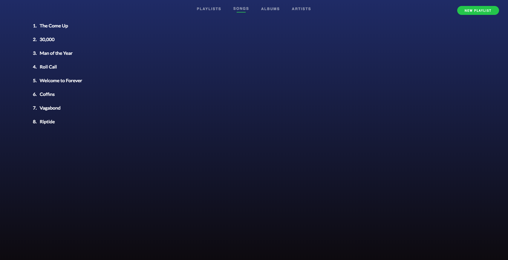
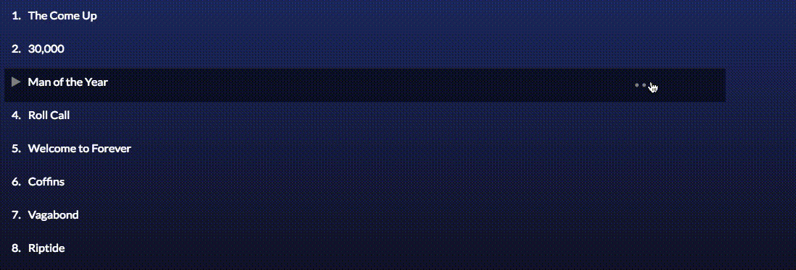

# [Procify](http://procify.herokuapp.com)

Procify is a web application that allows users to listen to songs and create playlists. It is built with Ruby on Rails as the backend, PostgreSQL as the database system, and React/Redux as the frontend.

## Notable Features

* Simultaneous search of all playlists, songs, artists, and albums.
* Volume control of a playing song.
* Seeking a playing song.
* Playlist CRUD.
* Queue for playing songs.

### Conditional Fetching of Data

To keep React components presentational, data was fetched and stored in the Redux store by the parent component. Here is the parent component:



Above the list of songs is a nav bar with Playlists, Songs, Albums, and Artists. All of these components are purely presentational: they do not fetch any data. Rather, they pull out the data that they need from the Redux store in their respective containers.

Initially, I struggled with how to conditionally fetch data based on which page was displayed. In the case of songs as seen in the picture, the component is `SongIndex`. The corresponding action to fetch data from the Rails backend and fill the Redux store with the necessary state is `fetchSongs`. Now, the question is how to conditionally display the correct component given the route. Having a wildcard parameter in the URL of `type` allows this to be possible:

```js
export const switchOnType = (props, components, actions, decision) => {
  let result;
  switch (props.match.params.type) {
    case 'tracks':
    result = {
      component: components.SongIndexContainer,
      action: actions.fetchSongs,
      id: null
    };
    return result[decision];

    default:
    return null;
  }
}
```

This function does a great deal of work. To get the correct component, an object full of possible components would have to be passed in along with the correct decision of 'component':

```js
const components = {
  SongIndexContainer,
  PlaylistShowContainer,
  PlaylistIndexContainer,
  AccountInfoContainer,
  AlbumIndexContainer,
  AlbumShowContainer,
  ArtistIndexContainer,
  ArtistShowContainer
};

const component = innerCollectionUtil.switchOnType(
  ownProps, components, {}, 'component'
  );
```

To get the correct action, the arguments would have to be:

```js
const actions = {
  fetchSongs,
  fetchPlaylist,
  fetchCurrentUsersPlaylists,
  fetchAlbum,
  fetchAlbums,
  fetchArtist,
  fetchArtists
};

const fetchAction = innerCollectionUtil.switchOnType(
  ownProps, {}, actions, 'action'
  );
```

Given the action and the correct component, the parent component can fetch data upon mounting:

```js
componentDidMount() {
  if (innerCollectionUtil.shouldFetchInfo(this.props)) {
    const id = innerCollectionUtil.switchOnType(
    this.props, {}, {}, 'id'
    );
    this.props.fetchAction(id);
    }
}
```

Now, the parent component can simply render the required component as `<this.props.component />`.

While this approach with a switch statement and conditionally fetching data seems like overkill for one component, this dramatically increases scalability. Adding another component to the parent component (say, another section on the nav bar) is incredibly easy. Another action would have to be added to the `actions` object, the new component would be added to `components`, and another switch clause would be written. In action, if `playlists` were just added, this switch clause would be added:

```js
case 'playlists':
result = {
  component: components.PlaylistIndexContainer,
  action: actions.fetchCurrentUsersPlaylists,
  id: props.currentUserId
  };
  return result[decision];
```

Just with that, the `PlaylistIndex` would be properly displayed and the proper data would be fetched.

### Dropdown Menu Positioning

Each song displays three dots when hovered. When this three dots are clicked, a dropdown menu is displayed at the **exact** location that is clicked. In action this looks like:



The three dots have an event listener listening for `click`. The positions of the cursor is easily extracted, where `e` is the event:

```js
const xPos = e.clientX;
const yPos = e.clientY;
```

These positions are stored in the Redux store and formatted as CSS style as such:

```js
const menuPos = {
  top: this.props.yPos,
  left: this.props.xPos
};
```

Now this can be passed down as inline style to the `DropdownMenu` component itself to correctly position the component at the exact spot that is clicked.
